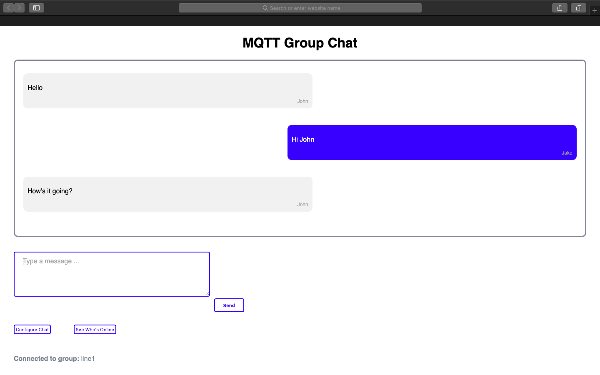
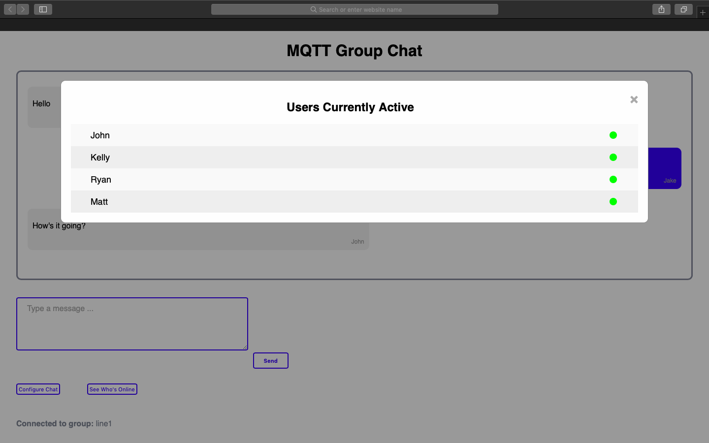

# MQTT-Group-Chat
A simple MQTT group chat application using the Paho MQTT JS library.  

Uses the Eclpise Mosquitto public broker for testing.

Allows you to see who else is connected to the same group.

